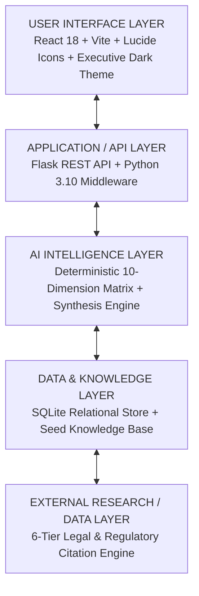

# VeriTrust AI — Enterprise AI Governance & Risk Intelligence Platform

**Candidate Name**: Vanshika Aggarwal  
**Assignment Selected**: Assignment 7 — AI Governance Research & Assessment Application  
**Target Domain Exposure**: BFSI / Financial Services, Healthcare, HR & Employment, Aviation & Aerospace  
**GitHub Repository**: [https://github.com/vanshika-data-lab/VeriTrust-AI-Governance](https://github.com/vanshika-data-lab/VeriTrust-AI-Governance)

---

## 📌 Executive Summary & Candidate Questionnaire Alignment

VeriTrust AI is a full-stack, enterprise-grade AI Governance and Risk Assessment platform built for the **Modus Enterprise AI Build Challenge**. 

As outlined in the candidate technical questionnaire, the platform:
1. **Avoids "Black-Box LLM Prompting"**: Implements a repeatable, deterministic 10-dimension risk scoring matrix (`scoring_matrix.py`) combined with structured research synthesis.
2. **Distinguishes 6 Source Tiers**: Classifies evidence across *Law / Regulation*, *Regulatory Guidance*, *Industry Standard*, *Research*, *Vendor Information*, and *General Web Content*.
3. **Executes Live Evaluator Tests ("Surprise Record")**: Accepts completely novel, un-seeded AI use cases dynamically without code modification.
4. **Persists Intelligence in SQLite**: Features structured database storage (`governance_app.db`) for use cases, assessments, 6-tier citations, and audit logs.
5. **Uses 100% Free & Open-Source Tech**: Runs locally without requiring paid software licenses or external API dependencies.

---

## 🏛️ Mandatory 5-Layer Application Architecture

The platform strictly follows the Modus 5-Layer Enterprise AI Architecture:



### Layer Breakdown:
1. **User Interface Layer**: Reactive, high-contrast dashboard with Executive Risk Analytics, Dynamic "Surprise Record" Test form, 10-Dimension Visual Meters, and 6-Tier Evidence Drawer.
2. **Application / API Layer**: Flask REST API providing stateless endpoints for use case ingestion, assessment orchestration, knowledge queries, and report generation.
3. **AI Intelligence Layer**: Combines deterministic weighted mathematical risk scoring (`scoring_matrix.py`) with evidence classification (`evidence_classifier.py`) and governance synthesis (`ai_synthesis.py`).
4. **Data & Knowledge Layer**: Persistent SQLite relational database (`governance_app.db`) with structured tables for `use_cases`, `assessments`, `knowledge_base`, and `audit_logs`.
5. **External Research / Data Layer**: Citation retrieval engine (`research_retriever.py`) backed by 15 canonical, verified legal and regulatory reference documents across 6 tiers.

---

## 🗄️ Database & Data Model Schema

The persistent SQLite database schema is defined as follows:

```sql
-- Use Cases Table
CREATE TABLE IF NOT EXISTS use_cases (
    id TEXT PRIMARY KEY,
    name TEXT NOT NULL,
    industry TEXT NOT NULL,
    purpose TEXT NOT NULL,
    autonomy_level TEXT NOT NULL,
    data_types TEXT NOT NULL,
    affected_population INTEGER,
    impact_tier TEXT,
    created_at TIMESTAMP DEFAULT CURRENT_TIMESTAMP
);

-- 10-Dimension Assessments Table
CREATE TABLE IF NOT EXISTS assessments (
    id TEXT PRIMARY KEY,
    use_case_id TEXT NOT NULL,
    overall_score REAL NOT NULL,
    risk_level TEXT NOT NULL,
    dimension_scores TEXT NOT NULL, -- JSON string of 10 dimensions
    findings TEXT NOT NULL,         -- JSON string of findings
    mitigations TEXT NOT NULL,      -- JSON string of controls
    citations TEXT NOT NULL,        -- JSON string of 6-tier citations
    evaluated_at TIMESTAMP DEFAULT CURRENT_TIMESTAMP,
    FOREIGN KEY(use_case_id) REFERENCES use_cases(id)
);

-- 6-Tier Knowledge Base Table
CREATE TABLE IF NOT EXISTS knowledge_base (
    id INTEGER PRIMARY KEY AUTOINCREMENT,
    source_tier TEXT NOT NULL,      -- Law / Regulatory / Standard / Research / Vendor / Web
    title TEXT NOT NULL,
    author_entity TEXT NOT NULL,
    jurisdiction TEXT,
    pub_date TEXT,
    url TEXT,
    summary_content TEXT NOT NULL,
    key_rules TEXT,                -- JSON string of rules
    tags TEXT
);

-- Audit Logs Table
CREATE TABLE IF NOT EXISTS audit_logs (
    id INTEGER PRIMARY KEY AUTOINCREMENT,
    assessment_id TEXT NOT NULL,
    action TEXT NOT NULL,
    timestamp TIMESTAMP DEFAULT CURRENT_TIMESTAMP
);
```

---

## 🛠️ Free Technology & Open-Source License Inventory

Per the Modus challenge rules, all components are 100% free, open-source, or locally runnable without paid software licenses:

| Component / Library | Version | License Type | Purpose in Application |
|---|---|---|---|
| **Python** | 3.10+ | PSFL (Open Source) | Core backend runtime |
| **Flask** | 3.0.3 | BSD-3-Clause | REST API web framework |
| **Flask-CORS** | 4.0.1 | MIT | Cross-Origin Resource Sharing middleware |
| **SQLite3** | 3.x | Public Domain / Free | Persistent relational database storage |
| **React** | 18.3.1 | MIT | Reactive UI framework |
| **Vite** | 5.4.21 | MIT | Lightning-fast frontend build tool & proxy |
| **Lucide-React** | 0.441.0 | ISC | High-quality UI icons |
| **Node.js** | 18+ | MIT / Open Source | Frontend JS execution environment |

### 🛡️ Resilience & Service Disruption Strategy:
- **Zero Paid Dependencies**: Does not rely on paid API keys (OpenAI/Anthropic).
- **Local Fallback**: The 10-dimension risk scoring engine runs 100% locally in Python via deterministic rules.
- **Persistent Offline Store**: All knowledge base entries and assessment histories remain fully functional offline using the embedded SQLite database.

---

## ⚡ Quick Start Guide

### Option 1: Single-Command Application Launcher (Recommended)

Run both the Flask REST API backend (Port 5000) and React Vite frontend (Port 3000) simultaneously with one command:

```bash
python run_app.py
```

Then open your browser at **`http://localhost:3000`**.

---

### Option 2: Manual Two-Terminal Startup

#### Terminal 1 — Start Backend Server:
```bash
cd backend
pip install flask flask-cors
python app.py
```
*(Backend runs at http://localhost:5000)*

#### Terminal 2 — Start Frontend Client:
```bash
cd frontend
npm install
npm run dev
```
*(Frontend runs at http://localhost:3000)*

---

## 🎬 Live Demonstration Script (10–15 Min Evaluator Guide)

For the live technical presentation and "Surprise Record" evaluation:

1. **Step 1: Risk Analytics Overview (2 mins)**
   - Open `http://localhost:3000`. Show the executive KPIs: Total Assessed Use Cases, High-Risk Alerts, 6-Tier Evidence Index, and Average Governance Score.
   - Highlight the **10 Mandatory Governance Assessment Areas** card with visual progress meters.

2. **Step 2: 6-Tier Knowledge Base Explorer (2 mins)**
   - Click **`6-Tier Knowledge Base`** in the top navigation.
   - Filter by *Law / Regulation* (e.g. EU AI Act, GDPR, NYC LL144, ECOA). Show how clicking **"Access Official Statutory Reference Document"** opens the official authority portal.

3. **Step 3: Execute "Surprise Record" Live Test (5 mins)**
   - Click **`Dynamic "Surprise Record" Test`** in the top navigation.
   - Click one of the quick sample buttons (e.g., *Biometric AI Attendance & Mood Monitor* in Corporate Workplace) or type a completely novel evaluator AI use case.
   - Click **`Execute Dynamic 10-Dimension Risk & Evidence Assessment`**.
   - Watch the 4-step real-time evaluation workflow (Architecture parsing -> 10-dim matrix computation -> 6-tier retrieval -> Statutory synthesis).

4. **Step 4: Detailed Audit & Evidence Review (3 mins)**
   - Review the generated **Risk Tier** (e.g., CRITICAL / HIGH).
   - Inspect the individual ratings across all 10 dimensions: Data Governance, Privacy, Bias/Fairness, Human Oversight, Explainability, Cybersecurity, Impact Severity, Regulatory Exposure, Model Risk, and Monitoring.
   - Open the **6-Tier Citation Drawer** to demonstrate how statutory obligations (e.g., EU AI Act Art. 14, NYC LL144 80% Rule) support the findings.

5. **Step 5: Export Compliance Report (2 mins)**
   - Click **`Export Full Audit Report`** to download the JSON report payload for enterprise compliance archives.

---

## 📡 REST API Specification

| HTTP Method | API Endpoint | Description |
|---|---|---|
| `GET` | `/api/use-cases` | Retrieve all evaluated AI use cases |
| `GET` | `/api/use-cases/<id>` | Retrieve specific use case details |
| `GET` | `/api/assessments/<id>` | Retrieve full 10-dimension assessment with 6-tier citations |
| `POST` | `/api/assess` | Dynamically assess a new AI use case ("Surprise Record") |
| `GET` | `/api/sources` | Query 6-tier knowledge base by search term or tier |
| `GET` | `/api/analytics` | Retrieve aggregate metrics, risk distribution, & industry breakdown |
| `GET` | `/api/export-report/<id>` | Export complete compliance audit report JSON payload |

---

## ⚖️ 10-Dimension Risk Matrix Criteria

1. **Data Governance**: Data sensitivity (PII, Biometrics, Health Data, Financial Records) and lineage tracking.
2. **Privacy Protection**: GDPR Art. 35 DPIA requirements, data minimization, and explicit consent protocols.
3. **Bias & Demographic Fairness**: Title VII 4/5ths (80%) Rule evaluation and protected attribute filtering.
4. **Human Oversight**: Decision autonomy tier (Fully Autonomous vs. Human-in-the-Loop) and EU AI Act Art. 14 override controls.
5. **Explainability & Transparency**: Black-box opacity scoring and ECOA 12 CFR 1002.9 adverse action notice capability.
6. **Cybersecurity & Robustness**: SOC 2 CC6.1 access control, prompt injection defense, and data poisoning resilience.
7. **Decision Impact Severity**: Reversibility of harm, affected population scale, and safety-critical operations.
8. **Regulatory Exposure**: Statutory liabilities under EU AI Act High-Risk rules, NYC LL144, FTC Sec. 5, and EEOC guidelines.
9. **Model Risk & Hallucination**: RAG grounding confidence thresholds and model drift tracking.
10. **Continuous Operational Monitoring**: Telemetry logging, audit logging frequency, and automated alert triggers.

---

## 📜 License & Compliance Statement
Developed for enterprise AI governance research, regulatory audit evaluation, and responsible AI deployment under the Modus Enterprise AI Build Challenge.
