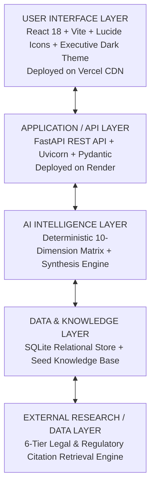
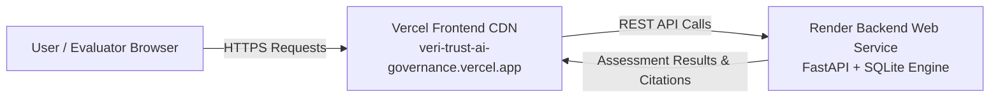

# VeriTrust AI — Enterprise AI Governance & Risk Intelligence Platform

**Candidate Name**: Vanshika Aggarwal  
**Assignment Selected**: Assignment 7 — AI Governance Research & Assessment Application  
**Target Domain Exposure**: BFSI / Financial Services, Healthcare & Life Sciences, HR & Employment, Aviation & Aerospace  etc. 

---

## 🌐 Live Production Cloud Deployment (Vercel + Render)

| Component | Cloud Platform | Live Deployment URL | Status |
|---|---|---|---|
| **Frontend Web Application** | **Vercel** | [https://veri-trust-ai-governance.vercel.app](https://veri-trust-ai-governance.vercel.app) | 🟢 Live |
| **Backend Governance API** | **Render** | [https://veritrust-ai-governance-1.onrender.com](https://veritrust-ai-governance-1.onrender.com) | 🟢 Live |
| **Interactive API Documentation (Swagger UI)** | **Render** | [https://veritrust-ai-governance-1.onrender.com/docs](https://veritrust-ai-governance-1.onrender.com/docs) | 🟢 Live |
| **API Health Check Endpoint** | **Render** | [https://veritrust-ai-governance-1.onrender.com/api/health](https://veritrust-ai-governance-1.onrender.com/api/health) | 🟢 Live |

---

## 📌 Executive Summary & Candidate Questionnaire Alignment

VeriTrust AI is a full-stack, enterprise-grade AI Governance and Risk Assessment platform built for the **Modus Enterprise AI Build Challenge**. 

As outlined in the candidate technical questionnaire, the platform:
1. **Avoids "Black-Box LLM Prompting"**: Implements a repeatable, deterministic 10-dimension risk scoring matrix (`scoring_matrix.py`) combined with structured research synthesis.
2. **Distinguishes 6 Source Tiers**: Classifies evidence across *Law / Regulation*, *Regulatory Guidance*, *Industry Standard*, *Research*, *Vendor Information*, and *General Web Content*.
3. **Executes Live Evaluator Tests ("Surprise Record")**: Accepts completely novel, un-seeded AI use cases dynamically without code modification.
4. **Persists Intelligence in SQLite**: Features structured database storage (`governance_app.db`) for use cases, assessments, 6-tier citations, and audit logs.
5. **Uses 100% Free & Open-Source Tech**: Runs locally and in cloud production without requiring paid software licenses or external API dependencies.

---

## 🏛️ Mandatory 5-Layer Application Architecture

The platform strictly follows the Modus 5-Layer Enterprise AI Architecture:



### Layer Breakdown:
1. **User Interface Layer**: Reactive, high-contrast dashboard with Executive Risk Analytics, Dynamic "Surprise Record" Test form, 10-Dimension Visual Meters, and 6-Tier Evidence Drawer.
2. **Application / API Layer**: FastAPI high-performance REST API providing stateless endpoints for use case ingestion, assessment orchestration, knowledge queries, and report generation.
3. **AI Intelligence Layer**: Combines deterministic weighted mathematical risk scoring (`scoring_matrix.py`) with evidence classification (`evidence_classifier.py`) and governance synthesis (`ai_synthesis.py`).
4. **Data & Knowledge Layer**: Persistent SQLite relational database (`governance_app.db`) with structured tables for `use_cases`, `assessments`, `dimension_assessments`, `evidence_sources`, and `knowledge_base`.
5. **External Research / Data Layer**: Citation retrieval engine (`research_retriever.py`) backed by 15 canonical, verified legal and regulatory reference documents across 6 tiers.

---

## 🚀 Cloud Production Deployment Guide

VeriTrust AI is fully deployed as a decoupled cloud system on **Vercel** (Frontend) and **Render** (Backend).



### A. Frontend Deployment on Vercel
1. Log in to [Vercel](https://vercel.com) using your GitHub account.
2. Click **"Add New..." ➔ "Project"** and import `vanshika-data-lab/VeriTrust-AI-Governance`.
3. Configure Build Settings:
   - **Framework Preset**: `Vite`
   - **Root Directory**: `frontend`
   - **Build Command**: `npm run build`
   - **Output Directory**: `dist`
4. Add Environment Variable (**Settings ➔ Environment Variables**):
   - **Key**: `VITE_API_BASE_URL`
   - **Value**: `https://veritrust-ai-governance-1.onrender.com` *(no trailing slash)*
   - **Target**: Production, Preview, Development
5. Click **"Deploy"** (or Redeploy if already created).

---

### B. Backend Deployment on Render
1. Log in to [Render](https://render.com) ➔ **"New" ➔ "Web Service"**.
2. Connect GitHub repository `vanshika-data-lab/VeriTrust-AI-Governance`.
3. Configure Service Parameters:
   - **Name**: `veritrust-ai-governance-1`
   - **Root Directory**: `backend`
   - **Runtime**: `Python 3`
   - **Build Command**: `pip install -r requirements.txt`
   - **Start Command**: `uvicorn main:app --host 0.0.0.0 --port $PORT`
   - **Instance Type**: `Free`
4. Click **"Create Web Service"**.

> **Note on Render Free Tier**: Free tier instances spin down after 15 minutes of inactivity. When a new request arrives, it takes ~30 seconds for the service to wake up (cold start).

---

## 🗄️ Database & Data Model Schema

The persistent SQLite database schema is defined as follows:

```sql
-- 1. Use Cases Table
CREATE TABLE IF NOT EXISTS use_cases (
    id INTEGER PRIMARY KEY AUTOINCREMENT,
    name TEXT NOT NULL,
    industry TEXT NOT NULL,
    purpose TEXT NOT NULL,
    autonomy_level TEXT NOT NULL,
    data_types TEXT NOT NULL, -- JSON array
    affected_population INTEGER DEFAULT 1000,
    impact_tier TEXT NOT NULL,
    is_preseeded BOOLEAN DEFAULT 0,
    created_at TIMESTAMP DEFAULT CURRENT_TIMESTAMP
);

-- 2. Assessments Table
CREATE TABLE IF NOT EXISTS assessments (
    id INTEGER PRIMARY KEY AUTOINCREMENT,
    use_case_id INTEGER NOT NULL,
    overall_risk_score REAL NOT NULL,
    risk_level TEXT NOT NULL,
    eu_ai_act_category TEXT NOT NULL,
    executive_summary TEXT NOT NULL,
    created_at TIMESTAMP DEFAULT CURRENT_TIMESTAMP,
    FOREIGN KEY (use_case_id) REFERENCES use_cases(id) ON DELETE CASCADE
);

-- 3. Dimension Assessments Table (10 mandatory governance areas)
CREATE TABLE IF NOT EXISTS dimension_assessments (
    id INTEGER PRIMARY KEY AUTOINCREMENT,
    assessment_id INTEGER NOT NULL,
    dimension_key TEXT NOT NULL,
    dimension_name TEXT NOT NULL,
    risk_score REAL NOT NULL,
    risk_level TEXT NOT NULL,
    findings TEXT NOT NULL,
    regulatory_impact TEXT NOT NULL,
    mitigating_controls TEXT NOT NULL, -- JSON array
    FOREIGN KEY (assessment_id) REFERENCES assessments(id) ON DELETE CASCADE
);

-- 4. Evidence Sources Table (6 mandatory source categories)
CREATE TABLE IF NOT EXISTS evidence_sources (
    id INTEGER PRIMARY KEY AUTOINCREMENT,
    assessment_id INTEGER NOT NULL,
    dimension_key TEXT NOT NULL,
    source_tier TEXT NOT NULL,
    title TEXT NOT NULL,
    author_entity TEXT NOT NULL,
    citation_text TEXT NOT NULL,
    url TEXT DEFAULT '',
    jurisdiction TEXT DEFAULT 'Global',
    pub_date TEXT DEFAULT '',
    reliability_score REAL DEFAULT 0.9,
    FOREIGN KEY (assessment_id) REFERENCES assessments(id) ON DELETE CASCADE
);

-- 5. Governance Knowledge Base Table
CREATE TABLE IF NOT EXISTS knowledge_base (
    id INTEGER PRIMARY KEY AUTOINCREMENT,
    source_tier TEXT NOT NULL,
    title TEXT NOT NULL,
    author_entity TEXT NOT NULL,
    jurisdiction TEXT NOT NULL,
    pub_date TEXT NOT NULL,
    url TEXT DEFAULT '',
    summary_content TEXT NOT NULL,
    key_rules TEXT NOT NULL, -- JSON array
    tags TEXT NOT NULL
);
```

---

## 🛠️ Free Technology & Open-Source License Inventory

Per the Modus challenge rules, all components are 100% free, open-source, or locally runnable without paid software licenses:

| Component / Library | Version | License Type | Purpose in Application |
|---|---|---|---|
| **Python** | 3.10+ | PSFL (Open Source) | Core backend runtime |
| **FastAPI** | 0.110.0+ | MIT | High-performance REST API web framework |
| **Uvicorn** | 0.28.0+ | BSD-3-Clause | ASGI production web server |
| **Pydantic** | 2.6.0+ | MIT | Request data validation & serialization |
| **HTTPX** | 0.27.0+ | BSD-3-Clause | Async HTTP client for live web retrieval |
| **SQLite3** | 3.x | Public Domain / Free | Persistent relational database storage |
| **React** | 18.3.1 | MIT | Reactive UI framework |
| **Vite** | 5.4.21 | MIT | Lightning-fast frontend build tool |
| **Lucide-React** | 0.441.0 | ISC | High-quality UI icons |
| **Node.js** | 18+ | MIT / Open Source | Frontend JS execution environment |

---

## ⚡ Local Development Quick Start

### Option 1: Single-Command Application Launcher

Run both the FastAPI backend (Port 8000) and React Vite frontend (Port 3000) simultaneously with one command:

```bash
python run_app.py
```

Then open your browser at **`http://localhost:3000`**.

---

### Option 2: Manual Two-Terminal Startup

#### Terminal 1 — Start FastAPI Backend Server:
```bash
cd backend
pip install -r requirements.txt
uvicorn main:app --host 0.0.0.0 --port 8000 --reload
```
*(Backend runs at `http://localhost:8000` | Swagger docs at `http://localhost:8000/docs`)*

#### Terminal 2 — Start Vite React Frontend:
```bash
cd frontend
npm install
npm run dev
```
*(Frontend runs at `http://localhost:3000`)*

---

## 🎬 Live Demonstration Script (10–15 Min Evaluator Guide)

[Pitch Video](https://drive.google.com/file/d/1545afRTlRXitDCadjbxbzboI5Hb9O9Vm/view?usp=drive_link)

---

## 📡 REST API Specification

| HTTP Method | API Endpoint | Description |
|---|---|---|
| `GET` | `/api/health` | Service health status check |
| `GET` | `/api/use-cases` | Retrieve all evaluated AI use cases |
| `DELETE` | `/api/use-cases/{id}` | Delete a use case and cascade-delete its assessments |
| `GET` | `/api/assessments/{id}` | Retrieve full 10-dimension assessment with 6-tier citations |
| `POST` | `/api/assess` | Dynamically assess a new AI use case ("Surprise Record") |
| `GET` | `/api/sources` | Query 6-tier knowledge base by search term or tier |
| `GET` | `/api/analytics` | Retrieve aggregate metrics, risk distribution, & industry breakdown |
| `GET` | `/api/export-report/{id}` | Export complete compliance audit report JSON payload |

---

## ⚖️ 10-Dimension Risk Matrix Criteria

1. **Data Governance**: Data sensitivity (PII, Biometrics, Health Data, Financial Records) and lineage tracking.
2. **Privacy Protection**: GDPR Art. 35 DPIA requirements, data minimization, and explicit consent protocols.
3. **Bias & Demographic Fairness**: Title VII 4/5ths (80%) Rule evaluation and protected attribute filtering.
4. **Human Oversight**: Decision autonomy tier (Fully Autonomous vs. Human-in-the-Loop) and EU AI Act Art. 14 override controls.
5. **Explainability & Transparency**: Black-box opacity scoring and ECOA 12 CFR 1002.9 adverse action notice capability.
6. **Cybersecurity & Robustness**: SOC 2 CC6.1 access control, prompt injection defense, and data poisoning resilience.
7. **Decision Impact Severity**: Reversibility of harm, affected population scale, and safety-critical operations.
8. **Regulatory Exposure**: Statutory liabilities under EU AI Act High-Risk rules, NYC LL144, FTC Sec. 5, and EEOC guidelines.
9. **Model Risk & Hallucination**: RAG grounding confidence thresholds and model drift tracking.
10. **Continuous Operational Monitoring**: Telemetry logging, audit logging frequency, and automated alert triggers.

---

## 📋 Final Submission Reference Table

| Field Name | Official Submission Content |
|---|---|
| **Live Application URL** | `https://veri-trust-ai-governance.vercel.app` |
| **Backend API URL** | `https://veritrust-ai-governance-1.onrender.com` |
| **GitHub Repository** | `https://github.com/vanshika-data-lab/VeriTrust-AI-Governance` |
| **Architecture Diagram (PDF)** | `https://github.com/vanshika-data-lab/VeriTrust-AI-Governance/blob/main/docs/ARCHITECTURE_DIAGRAM.pdf` |
| **Architecture Diagram (PNG)** | `https://github.com/vanshika-data-lab/VeriTrust-AI-Governance/blob/main/docs/ARCHITECTURE_DIAGRAM.png` |
| **Technical Documentation (PDF)** | `https://github.com/vanshika-data-lab/VeriTrust-AI-Governance/blob/main/docs/TECHNICAL_DOCUMENTATION.pdf` |
| **Database Model (PDF)** | `https://github.com/vanshika-data-lab/VeriTrust-AI-Governance/blob/main/docs/DATABASE_DATA_MODEL.pdf` |
| **Database Model (PNG)** | `https://github.com/vanshika-data-lab/VeriTrust-AI-Governance/blob/main/docs/DATABASE_DATA_MODEL.png` |

---

## 📜 License & Compliance Statement
Developed for enterprise AI governance research, regulatory audit evaluation, and responsible AI deployment under the Modus Enterprise AI Build Challenge.
