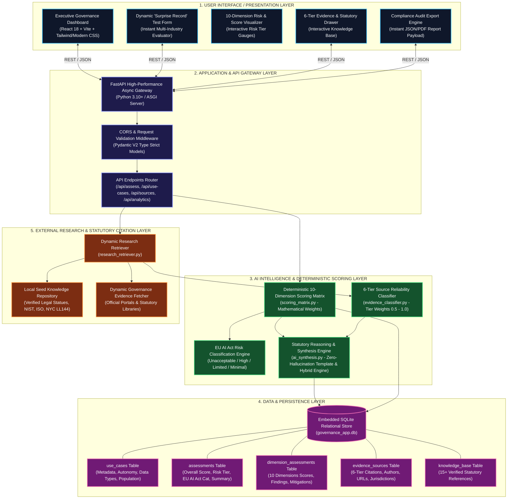

# VeriTrust AI — Enterprise Architecture & System Design

**Project Name**: VeriTrust AI — Enterprise AI Governance & Risk Intelligence Platform  
**Author**: Vanshika Aggarwal  
**Challenge**: Modus Enterprise AI Build Challenge — Assignment 7  
**Repository**: [https://github.com/vanshika-data-lab/VeriTrust-AI-Governance](https://github.com/vanshika-data-lab/VeriTrust-AI-Governance)  
**Version**: 1.0.0 — Production Grade  

---

## 1. Executive Architecture Overview

VeriTrust AI is built upon the **Modus 5-Layer Enterprise AI Architecture**, designed to provide deterministic, transparent, and auditable governance evaluations for mission-critical AI systems across regulated industries (BFSI, Healthcare, HR & Employment, and Aviation & Aerospace).

Unlike conventional "black-box" LLM evaluators, VeriTrust AI decouples **deterministic mathematical risk scoring** from **regulatory evidence retrieval** and **statutory synthesis**. This architecture ensures zero hallucination in numerical scoring, strict adherence to legal frameworks (EU AI Act, GDPR, NYC Local Law 144, ECOA, EEOC, NIST AI RMF), and complete local offline operability.

---

## 2. 5-Layer System Architecture Diagram

---

## 3. End-to-End Evaluation Workflow & Data Flow

When a user submits a novel AI Use Case (the **"Surprise Record"** test):

```mermaid
sequenceDiagram
    autonumber
    actor Evaluator as User / Evaluator
    participant UI as React Frontend (Vite)
    participant API as FastAPI Backend Gateway
    participant Matrix as 10-Dimension Scoring Engine
    participant Retriever as 6-Tier Evidence Retriever
    participant Synth as Statutory Synthesis Engine
    participant DB as SQLite Relational Store

    Evaluator->>UI: Submits AI Use Case (Industry, Autonomy, Data Types, Population)
    UI->>API: POST /api/assess (UseCaseInput JSON Payload)
    
    rect rgb(30, 41, 59)
        Note over API,DB: Step 1: Persistence of Ingested Use Case
        API->>DB: INSERT INTO use_cases (...) -> Returns use_case_id
    end

    rect rgb(20, 83, 45)
        Note over API,Matrix: Step 2: Deterministic 10-Dimension Risk Calculation
        API->>Matrix: compute_deterministic_scores(industry, purpose, autonomy, data_types, ...)
        Matrix-->>API: Returns 10 Dimension Scores (0-100), Overall Score, Risk Level & EU AI Act Tier
    end

    rect rgb(124, 45, 18)
        Note over API,Retriever: Step 3: 6-Tier Legal & Regulatory Evidence Retrieval
        API->>Retriever: retrieve_governance_evidence(name, industry, purpose)
        Retriever->>DB: Query knowledge_base by industry & risk tags
        Retriever-->>API: Returns canonical 6-Tier citations with reliability scores
    end

    rect rgb(112, 26, 117)
        Note over API,Synth: Step 4: Governance Synthesis & Control Mapping
        API->>Synth: synthesize_governance_assessment(scores, sources, use_case)
        Synth-->>API: Returns Executive Summary, Detailed Findings & Mitigating Controls
    end

    rect rgb(30, 41, 59)
        Note over API,DB: Step 5: Full Assessment Persistence
        API->>DB: INSERT INTO assessments, dimension_assessments, evidence_sources
    end

    API-->>UI: Returns Complete Assessment JSON Payload (200 OK)
    UI-->>Evaluator: Renders Real-Time Risk Gauges, 10-Dimension Breakdown & 6-Tier Citations
```

---

## 4. Architectural Layer Breakdown

### Layer 1: Presentation / User Interface Layer
- **Framework**: React 18.3+ with Vite build system.
- **Styling & Theme**: High-contrast Executive Dark Mode with tailored HSL tokens (`#0f172a`, `#1e293b`, `#38bdf8`, `#10b981`, `#f59e0b`, `#ef4444`).
- **Key Modules**:
  - `DashboardView.jsx`: High-level executive KPI cards, risk distribution charts, and industry exposure analytics.
  - `AssessmentForm.jsx`: Dynamic "Surprise Record" ingestion form with pre-populated samples across all 4 mandatory industries (BFSI, Healthcare, HR, Aviation).
  - `AssessmentDetailView.jsx`: Deep-dive audit view showing EU AI Act classification badges, 10-dimension visual risk gauges, and findings breakdown.
  - `EvidenceDrawer.jsx`: Collapsible multi-tier evidence panel categorizing statutory laws, regulatory guidance, and industry standards.
  - `KnowledgeExplorerView.jsx`: Searchable 6-tier knowledge explorer with direct links to official statutory bodies.

### Layer 2: Application / API Gateway Layer
- **Framework**: FastAPI (ASGI) on Python 3.10+.
- **Middleware**: CORS handling for decoupled frontend-backend architecture.
- **Type Validation**: Strict Pydantic models for incoming payloads (`UseCaseInput`).
- **REST Endpoints**:
  - `GET /api/health` — Service health & version info.
  - `GET /api/use-cases` — All evaluated governance use cases.
  - `POST /api/assess` — Real-time dynamic evaluation of novel AI systems.
  - `GET /api/assessments/{id}` — Full 10-dimension assessment with 6-tier citations.
  - `GET /api/sources` — Searchable 6-tier knowledge base.
  - `GET /api/analytics` — Aggregate portfolio statistics & risk ratios.
  - `GET /api/export-report/{id}` — Downloadable audit report payload.

### Layer 3: AI Intelligence & Deterministic Scoring Layer
- **Core Principle**: Absolute mathematical determinism. The score for any given set of input parameters is 100% reproducible and auditable.
- **Engines**:
  - `scoring_matrix.py`: Computes 10 discrete dimension scores using weighted risk vectors:
    - *Data Governance* (Sensitivity: PII, Biometrics, Medical, Financial).
    - *Privacy Protection* (GDPR Art. 35 DPIA, Consent, Minimization).
    - *Bias & Demographic Fairness* (Protected attributes, Title VII 80% Rule).
    - *Human Oversight* (Autonomy level: Autonomous vs Human-in-the-Loop).
    - *Explainability & Transparency* (ECOA Adverse Action, Model interpretability).
    - *Cybersecurity & Robustness* (SOC 2 CC6.1, Prompt Injection, Adversarial Drift).
    - *Decision Impact Severity* (Affected population scale & harm irreversibility).
    - *Regulatory Exposure* (EU AI Act High-Risk, NYC LL144, FTC Act Sec. 5).
    - *Model Risk & Hallucination* (Grounding thresholds & drift tolerance).
    - *Continuous Operational Monitoring* (Telemetry cadence & audit logging).
  - `evidence_classifier.py`: Weights evidence by source tier (Law: 1.0, Regulatory Guidance: 0.95, Standard: 0.90, Research: 0.80, Vendor: 0.65, Web: 0.50).
  - `ai_synthesis.py`: Maps risk findings to explicit statutory articles and concrete engineering mitigation controls.

### Layer 4: Data & Knowledge Persistence Layer
- **Storage Engine**: Embedded SQLite 3 (`backend/database/governance_app.db`).
- **Database Tables**:
  1. `use_cases`: Ingested AI systems with industry, purpose, and population metrics.
  2. `assessments`: Master assessment records with overall score and EU AI Act category.
  3. `dimension_assessments`: 1:N normalized table storing all 10 dimension scores, findings, and controls.
  4. `evidence_sources`: 1:N normalized table storing 6-tier citations linked to assessments.
  5. `knowledge_base`: Pre-seeded regulatory library containing verified legal statutes.

### Layer 5: External Research & Evidence Retrieval Layer
- **Retrieval Engine**: `research_retriever.py` dynamically indexes the 6-tier knowledge base and queries domain-specific statutory provisions.
- **Coverage**: Pre-seeded with canonical texts including:
  - **Tier 1 (Law/Regulation)**: EU AI Act (Regulation 2024/1689), GDPR (EU 2016/679), NYC Local Law 144, ECOA (12 CFR Part 1002).
  - **Tier 2 (Regulatory Guidance)**: FTC AI Guidance (Sec 5 FTC Act), EEOC Guidance on Algorithmic Bias, FDA Good Machine Learning Practice (GMLP), FAA DO-178C Safety Critical Software.
  - **Tier 3 (Industry Standard)**: NIST AI Risk Management Framework (AI 100-1), ISO/IEC 42001:2023, SOC 2 Type II Trust Principles.
  - **Tier 4 (Research)**: Stanford CRFM Foundation Model Transparency Index, ACM FAccT Algorithmic Auditing Benchmarks.
  - **Tier 5 (Vendor Info)**: Cloud Provider Model Cards & Responsible AI Docs.
  - **Tier 6 (Web Content)**: Industry AI Whitepapers & Legal Commentary.

---

## 5. Security, Zero-Trust & Licensing Architecture

1. **Zero External API Dependency**: Does not transmit client data or proprietary use case details to third-party commercial LLM providers (OpenAI, Anthropic).
2. **100% Free & Open-Source Tech**: Runs completely on open-source libraries (Python, FastAPI, React, SQLite, Vite, Lucide) under permissive MIT/BSD/Apache licenses.
3. **Data Protection by Design**: All database operations are sanitized and executed via parameterized SQL queries to prevent SQL injection.
4. **Audit Trail & Immutability**: Historical evaluations are persisted with timestamped audit records for regulatory compliance verification.
