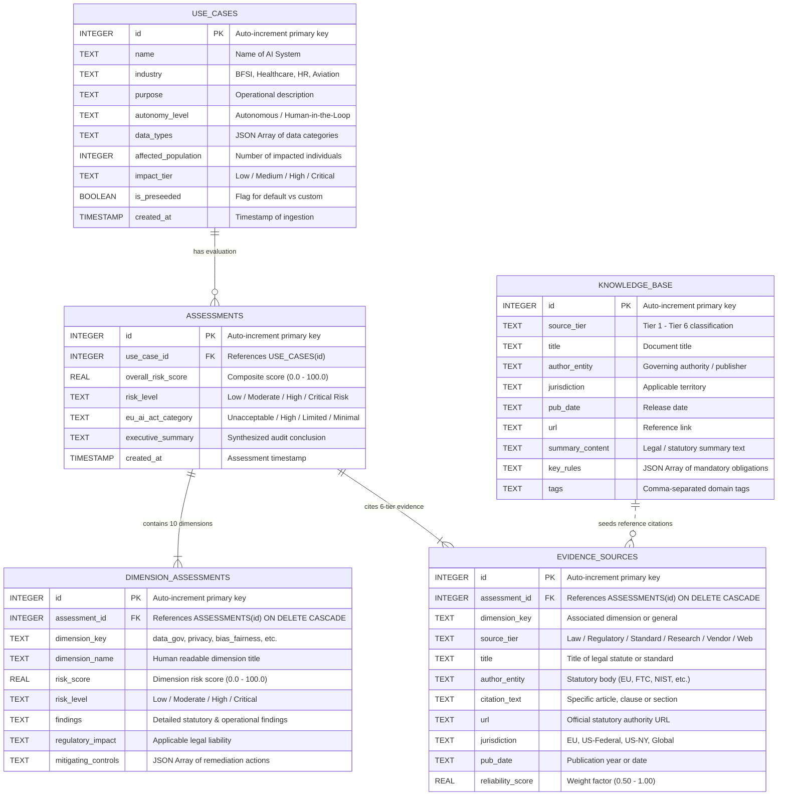
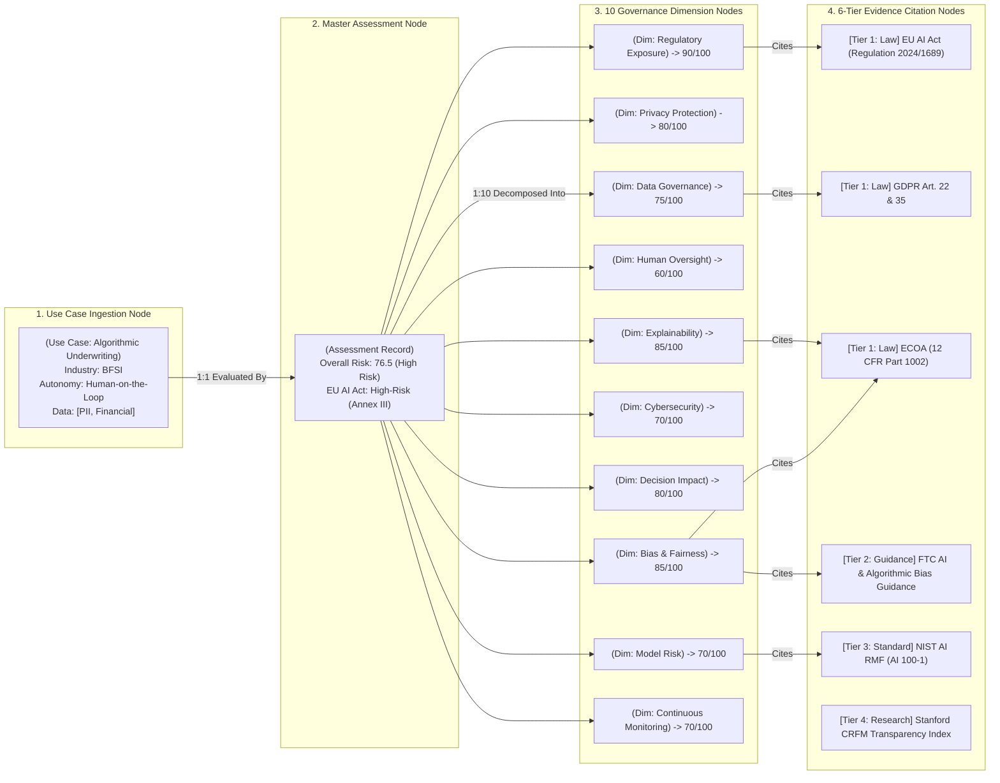

# VeriTrust AI — Database Schema & Data Model Specification

**Project Name**: VeriTrust AI — Enterprise AI Governance & Risk Intelligence Platform  
**Author**: Vanshika Aggarwal  
**Challenge**: Modus Enterprise AI Build Challenge — Assignment 7  
**Repository**: [https://github.com/vanshika-data-lab/VeriTrust-AI-Governance](https://github.com/vanshika-data-lab/VeriTrust-AI-Governance)  
**Database Engine**: SQLite 3 (Embeddable, Zero-Configuration, Relational ACID compliant)  
**Database File**: `backend/database/governance_app.db`  

---

## 1. Entity-Relationship (ER) Diagram

The data model is fully normalized to 3NF (Third Normal Form) with relational integrity and cascade-delete rules.



---

## 2. Graph & Relational Data Flow Model

VeriTrust AI structures governance data as a **Hierarchical Knowledge Graph mapped to a Relational Schema**:



---

## 3. Detailed Table Schema Definitions (SQL DDL)

### 3.1 Table: `use_cases`
Stores ingested AI systems submitted for governance review.

| Column Name | Data Type | Constraints | Description |
|---|---|---|---|
| `id` | `INTEGER` | `PRIMARY KEY AUTOINCREMENT` | Unique identifier for each use case |
| `name` | `TEXT` | `NOT NULL` | Name of the AI system / application |
| `industry` | `TEXT` | `NOT NULL` | BFSI, Healthcare, HR & Employment, Aviation |
| `purpose` | `TEXT` | `NOT NULL` | Functional scope and operational description |
| `autonomy_level` | `TEXT` | `NOT NULL` | Advisory, Human-in-the-Loop, Human-on-the-Loop, Fully Autonomous |
| `data_types` | `TEXT` | `NOT NULL` | JSON serialized array of processed data classifications (e.g., `["PII", "Biometric"]`) |
| `affected_population` | `INTEGER` | `DEFAULT 1000` | Estimated user or stakeholder count impacted |
| `impact_tier` | `TEXT` | `NOT NULL` | Low, Medium, High, Critical |
| `is_preseeded` | `BOOLEAN` | `DEFAULT 0` | Flag indicating default demo records vs dynamic evaluator tests |
| `created_at` | `TIMESTAMP` | `DEFAULT CURRENT_TIMESTAMP` | System creation timestamp |

```sql
CREATE TABLE IF NOT EXISTS use_cases (
    id INTEGER PRIMARY KEY AUTOINCREMENT,
    name TEXT NOT NULL,
    industry TEXT NOT NULL,
    purpose TEXT NOT NULL,
    autonomy_level TEXT NOT NULL,
    data_types TEXT NOT NULL,
    affected_population INTEGER DEFAULT 1000,
    impact_tier TEXT NOT NULL,
    is_preseeded BOOLEAN DEFAULT 0,
    created_at TIMESTAMP DEFAULT CURRENT_TIMESTAMP
);
```

---

### 3.2 Table: `assessments`
Master assessment record storing composite scoring, risk tier, and EU AI Act classification.

| Column Name | Data Type | Constraints | Description |
|---|---|---|---|
| `id` | `INTEGER` | `PRIMARY KEY AUTOINCREMENT` | Unique assessment ID |
| `use_case_id` | `INTEGER` | `NOT NULL, FOREIGN KEY -> use_cases(id) ON DELETE CASCADE` | Associated use case reference |
| `overall_risk_score` | `REAL` | `NOT NULL` | Weighted composite risk score (0.0 to 100.0) |
| `risk_level` | `TEXT` | `NOT NULL` | Low Risk, Moderate Risk, High Risk, Critical Risk |
| `eu_ai_act_category` | `TEXT` | `NOT NULL` | Minimal Risk, Limited Risk, High-Risk (Annex III), Unacceptable Risk (Article 5) |
| `executive_summary` | `TEXT` | `NOT NULL` | Executive compliance and statutory synthesis summary |
| `created_at` | `TIMESTAMP` | `DEFAULT CURRENT_TIMESTAMP` | Assessment timestamp |

```sql
CREATE TABLE IF NOT EXISTS assessments (
    id INTEGER PRIMARY KEY AUTOINCREMENT,
    use_case_id INTEGER NOT NULL,
    overall_risk_score REAL NOT NULL,
    risk_level TEXT NOT NULL,
    eu_ai_act_category TEXT NOT NULL,
    executive_summary TEXT NOT NULL,
    created_at TIMESTAMP DEFAULT CURRENT_TIMESTAMP,
    FOREIGN KEY (use_case_id) REFERENCES use_cases(id) ON DELETE CASCADE
);
```

---

### 3.3 Table: `dimension_assessments`
Stores granular evaluation across all 10 mandatory governance assessment areas.

| Column Name | Data Type | Constraints | Description |
|---|---|---|---|
| `id` | `INTEGER` | `PRIMARY KEY AUTOINCREMENT` | Dimension record ID |
| `assessment_id` | `INTEGER` | `NOT NULL, FOREIGN KEY -> assessments(id) ON DELETE CASCADE` | Parent assessment reference |
| `dimension_key` | `TEXT` | `NOT NULL` | Unique key (`data_gov`, `privacy`, `bias_fairness`, `oversight`, etc.) |
| `dimension_name` | `TEXT` | `NOT NULL` | Display name (e.g., "Data Governance & Lineage") |
| `risk_score` | `REAL` | `NOT NULL` | Normalized dimension score (0.0 - 100.0) |
| `risk_level` | `TEXT` | `NOT NULL` | Low / Moderate / High / Critical |
| `findings` | `TEXT` | `NOT NULL` | Statutory and operational risk findings |
| `regulatory_impact` | `TEXT` | `NOT NULL` | Applicable regulatory violation exposure |
| `mitigating_controls` | `TEXT` | `NOT NULL` | JSON serialized array of specific remediation controls |

```sql
CREATE TABLE IF NOT EXISTS dimension_assessments (
    id INTEGER PRIMARY KEY AUTOINCREMENT,
    assessment_id INTEGER NOT NULL,
    dimension_key TEXT NOT NULL,
    dimension_name TEXT NOT NULL,
    risk_score REAL NOT NULL,
    risk_level TEXT NOT NULL,
    findings TEXT NOT NULL,
    regulatory_impact TEXT NOT NULL,
    mitigating_controls TEXT NOT NULL,
    FOREIGN KEY (assessment_id) REFERENCES assessments(id) ON DELETE CASCADE
);
```

---

### 3.4 Table: `evidence_sources`
Stores 6-tier legal, regulatory, and research citations linked to each assessment.

| Column Name | Data Type | Constraints | Description |
|---|---|---|---|
| `id` | `INTEGER` | `PRIMARY KEY AUTOINCREMENT` | Evidence record ID |
| `assessment_id` | `INTEGER` | `NOT NULL, FOREIGN KEY -> assessments(id) ON DELETE CASCADE` | Parent assessment reference |
| `dimension_key` | `TEXT` | `NOT NULL` | Related governance dimension key or "general" |
| `source_tier` | `TEXT` | `NOT NULL` | Law / Regulation, Regulatory Guidance, Industry Standard, Research, Vendor Information, General Web Content |
| `title` | `TEXT` | `NOT NULL` | Canonical title of the statute, standard, or study |
| `author_entity` | `TEXT` | `NOT NULL` | Authoritative organization (e.g., European Parliament, FTC, NIST, Stanford CRFM) |
| `citation_text` | `TEXT` | `NOT NULL` | Specific statutory article, recital, or section citation |
| `url` | `TEXT` | `DEFAULT ''` | Official statutory reference URL |
| `jurisdiction` | `TEXT` | `DEFAULT 'Global'` | Governing jurisdiction (EU, US-Federal, US-NY, International) |
| `pub_date` | `TEXT` | `DEFAULT ''` | Publication year or promulgation date |
| `reliability_score` | `REAL` | `DEFAULT 0.9` | Evidence tier reliability weight (0.50 to 1.00) |

```sql
CREATE TABLE IF NOT EXISTS evidence_sources (
    id INTEGER PRIMARY KEY AUTOINCREMENT,
    assessment_id INTEGER NOT NULL,
    dimension_key TEXT NOT NULL,
    source_tier TEXT NOT NULL,
    title TEXT NOT NULL,
    author_entity TEXT NOT NULL,
    citation_text TEXT NOT NULL,
    url TEXT DEFAULT '',
    jurisdiction TEXT DEFAULT 'Global',
    pub_date TEXT DEFAULT '',
    reliability_score REAL DEFAULT 0.9,
    FOREIGN KEY (assessment_id) REFERENCES assessments(id) ON DELETE CASCADE
);
```

---

### 3.5 Table: `knowledge_base`
Canonical repository of pre-seeded regulatory knowledge and reference standards.

| Column Name | Data Type | Constraints | Description |
|---|---|---|---|
| `id` | `INTEGER` | `PRIMARY KEY AUTOINCREMENT` | Knowledge base entry ID |
| `source_tier` | `TEXT` | `NOT NULL` | Tier classification (Tier 1 - Tier 6) |
| `title` | `TEXT` | `NOT NULL` | Legal act or framework title |
| `author_entity` | `TEXT` | `NOT NULL` | Regulatory body or publisher |
| `jurisdiction` | `TEXT` | `NOT NULL` | Territorial scope |
| `pub_date` | `TEXT` | `NOT NULL` | Enactment date |
| `url` | `TEXT` | `DEFAULT ''` | Authority portal link |
| `summary_content` | `TEXT` | `NOT NULL` | Comprehensive statutory summary |
| `key_rules` | `TEXT` | `NOT NULL` | JSON serialized array of core legal requirements |
| `tags` | `TEXT` | `NOT NULL` | Search and domain tags |

```sql
CREATE TABLE IF NOT EXISTS knowledge_base (
    id INTEGER PRIMARY KEY AUTOINCREMENT,
    source_tier TEXT NOT NULL,
    title TEXT NOT NULL,
    author_entity TEXT NOT NULL,
    jurisdiction TEXT NOT NULL,
    pub_date TEXT NOT NULL,
    url TEXT DEFAULT '',
    summary_content TEXT NOT NULL,
    key_rules TEXT NOT NULL,
    tags TEXT NOT NULL
);
```

---

## 4. Indexing & Query Performance Strategy

To ensure sub-millisecond retrieval times across high-concurrency evaluation workloads:

```sql
-- Fast lookups by industry and preseeded status
CREATE INDEX IF NOT EXISTS idx_use_cases_industry ON use_cases(industry);
CREATE INDEX IF NOT EXISTS idx_use_cases_created ON use_cases(created_at DESC);

-- Fast join on foreign keys
CREATE INDEX IF NOT EXISTS idx_assessments_use_case ON assessments(use_case_id);
CREATE INDEX IF NOT EXISTS idx_dimension_assessment ON dimension_assessments(assessment_id);
CREATE INDEX IF NOT EXISTS idx_evidence_assessment ON evidence_sources(assessment_id);

-- Full-text / fast search on knowledge base
CREATE INDEX IF NOT EXISTS idx_kb_tier ON knowledge_base(source_tier);
CREATE INDEX IF NOT EXISTS idx_kb_jurisdiction ON knowledge_base(jurisdiction);
```

---

## 5. Sample Ingested Record (JSON Payload Schema)

```json
{
  "id": 1,
  "use_case_name": "Algorithmic Credit Underwriting & Risk Scoring",
  "industry": "BFSI / Financial Services",
  "purpose": "Automated ML model that evaluates creditworthiness and determines credit card limits and loan interest rates for individual banking customers.",
  "autonomy_level": "Human-on-the-Loop",
  "data_types": ["PII", "Financial", "Credit History", "Protected Attributes"],
  "affected_population": 250000,
  "impact_tier": "High",
  "overall_risk_score": 76.5,
  "risk_level": "High Risk",
  "eu_ai_act_category": "High-Risk (Annex III Category 5b)",
  "executive_summary": "System classified as High Risk under EU AI Act Annex III due to automated financial creditworthiness determination. Significant compliance obligations under GDPR Art. 22 and ECOA Adverse Action Notice requirements.",
  "dimensions": [
    {
      "dimension_key": "bias_fairness",
      "dimension_name": "Bias & Demographic Fairness",
      "risk_score": 85.0,
      "risk_level": "High Risk",
      "findings": "Use of historical credit data introduces systemic disparate impact across demographic sub-groups.",
      "regulatory_impact": "Violation of Equal Credit Opportunity Act (ECOA 12 CFR 1002) and Title VII 80% adverse impact rule.",
      "mitigating_controls": [
        "Implement continuous disparate impact ratio (DIR) testing",
        "Perform pre-deployment adversarial bias debiasing on training sets",
        "Quarterly independent fair lending algorithmic audit"
      ]
    }
  ],
  "sources": [
    {
      "source_tier": "Law / Regulation",
      "title": "EU AI Act (Regulation 2024/1689)",
      "author_entity": "European Parliament & Council",
      "citation_text": "Annex III(5)(b) — AI systems used to evaluate creditworthiness of natural persons.",
      "url": "https://eur-lex.europa.eu/eli/reg/2024/1689/oj",
      "jurisdiction": "European Union",
      "reliability_score": 1.0
    }
  ]
}
```
