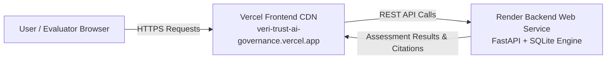

# VeriTrust AI — Live Application URL & Cloud Deployment Guide

**Project**: VeriTrust AI — Enterprise AI Governance Platform  
**Author**: Vanshika Aggarwal  
**Challenge**: Modus Enterprise AI Build Challenge — Assignment 7  
**GitHub Repository**: [https://github.com/vanshika-data-lab/VeriTrust-AI-Governance](https://github.com/vanshika-data-lab/VeriTrust-AI-Governance)  

---

## 1. Live Application URLs

| Component | Cloud Platform | Live Deployment URL | Status |
|---|---|---|---|
| **Frontend Web Application** | **Vercel** | [https://veri-trust-ai-governance.vercel.app](https://veri-trust-ai-governance.vercel.app) | 🟢 Live |
| **Backend Governance API** | **Render** | [https://veritrust-ai-governance-1.onrender.com](https://veritrust-ai-governance-1.onrender.com) | 🟢 Live |
| **Interactive API Docs (Swagger UI)** | **Render** | [https://veritrust-ai-governance-1.onrender.com/docs](https://veritrust-ai-governance-1.onrender.com/docs) | 🟢 Live |
| **API Health Check Endpoint** | **Render** | [https://veritrust-ai-governance-1.onrender.com/api/health](https://veritrust-ai-governance-1.onrender.com/api/health) | 🟢 Live |

---

## 2. Cloud Production Deployment Architecture (Vercel + Render)

VeriTrust AI is architected as a decoupled, production-ready cloud system:
* **Frontend**: React 18 + Vite single-page application deployed on the **Vercel Edge Network**.
* **Backend**: FastAPI + SQLite 10-dimension deterministic assessment engine deployed as a Web Service on **Render**.

---

## 3. Deployment Configuration

### A. Frontend on Vercel
1. Log in to [Vercel](https://vercel.com) using your GitHub account.
2. Import repository `vanshika-data-lab/VeriTrust-AI-Governance`.
3. Configure Build Settings:
   - **Framework Preset**: `Vite`
   - **Root Directory**: `frontend`
   - **Build Command**: `npm run build`
   - **Output Directory**: `dist`
4. Environment Variables (**Settings ➔ Environment Variables**):
   - **Key**: `VITE_API_BASE_URL`
   - **Value**: `https://veritrust-ai-governance-1.onrender.com`
   - **Target**: Production, Preview, Development

---

### B. Backend API on Render
1. Log in to [Render](https://render.com) ➔ **"New" ➔ "Web Service"**.
2. Connect your GitHub repository `vanshika-data-lab/VeriTrust-AI-Governance`.
3. Configure Service Parameters:
   - **Name**: `veritrust-ai-governance-1`
   - **Root Directory**: `backend`
   - **Environment / Runtime**: `Python 3`
   - **Build Command**: `pip install -r requirements.txt`
   - **Start Command**: `uvicorn main:app --host 0.0.0.0 --port $PORT`
   - **Instance Type**: `Free`

> **Render Free Tier Spin-Down Notice**: Free instances spin down after 15 minutes of inactivity. When a new request arrives, it takes ~30 seconds for the service to wake up (cold start).

---

## 4. Final Submission Form Reference Table

| Field Name | Official Submission Content |
|---|---|
| **Live Application URL** | `https://veri-trust-ai-governance.vercel.app` |
| **Backend API URL** | `https://veritrust-ai-governance-1.onrender.com` |
| **GitHub Repository** | `https://github.com/vanshika-data-lab/VeriTrust-AI-Governance` |
| **Architecture Diagram** | `https://github.com/vanshika-data-lab/VeriTrust-AI-Governance/blob/main/docs/ARCHITECTURE_DIAGRAM.md` |
| **Technical Documentation** | `https://github.com/vanshika-data-lab/VeriTrust-AI-Governance/blob/main/docs/TECHNICAL_DOCUMENTATION.md` |
| **Database Model** | `https://github.com/vanshika-data-lab/VeriTrust-AI-Governance/blob/main/docs/DATABASE_DATA_MODEL.md` |
